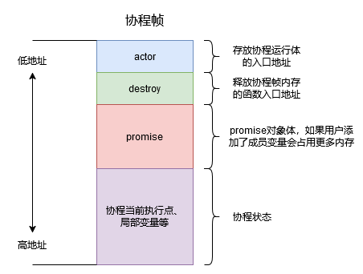

promise,协程句柄,协程状态
co_await,co_return,co_yield

协程帧的结构

包含promise_type的类统称为UserFacing
coroutine_handle:外部用以操作协程的句柄
1.promise与coroutine_handle可以互相转化
2.拿到协程句柄操作:
* handle.promise() 拿到promise
* handle.done()    判断协程是否执行结束
* handle.resume()  让暂停的协程继续运行
* handle.destory() 回收协程栈

promise:协程的核心
1.构造:调用协程时，编译器找promise_type对应的promise构造在协程帧上(promise可以有多个构造函数)
2.get_return_object - 获取的对象(包含promise的类)是通过它构造出来的,参数为空
                      UserFacing会将coroutine_handle作为构造函数的参数，就可以访问promise的数据
3.initial_suspend   -  协程创建时的调度点   suspend_always(暂停) suspend_never(继续执行)
4.final_suspend
5.co_return & return_value
6.co_yield & yield_value
7.unhandled_exception

问题:
协程设计为什么要将写成参数列表与promise构造函数关联?
a:传递this指针
